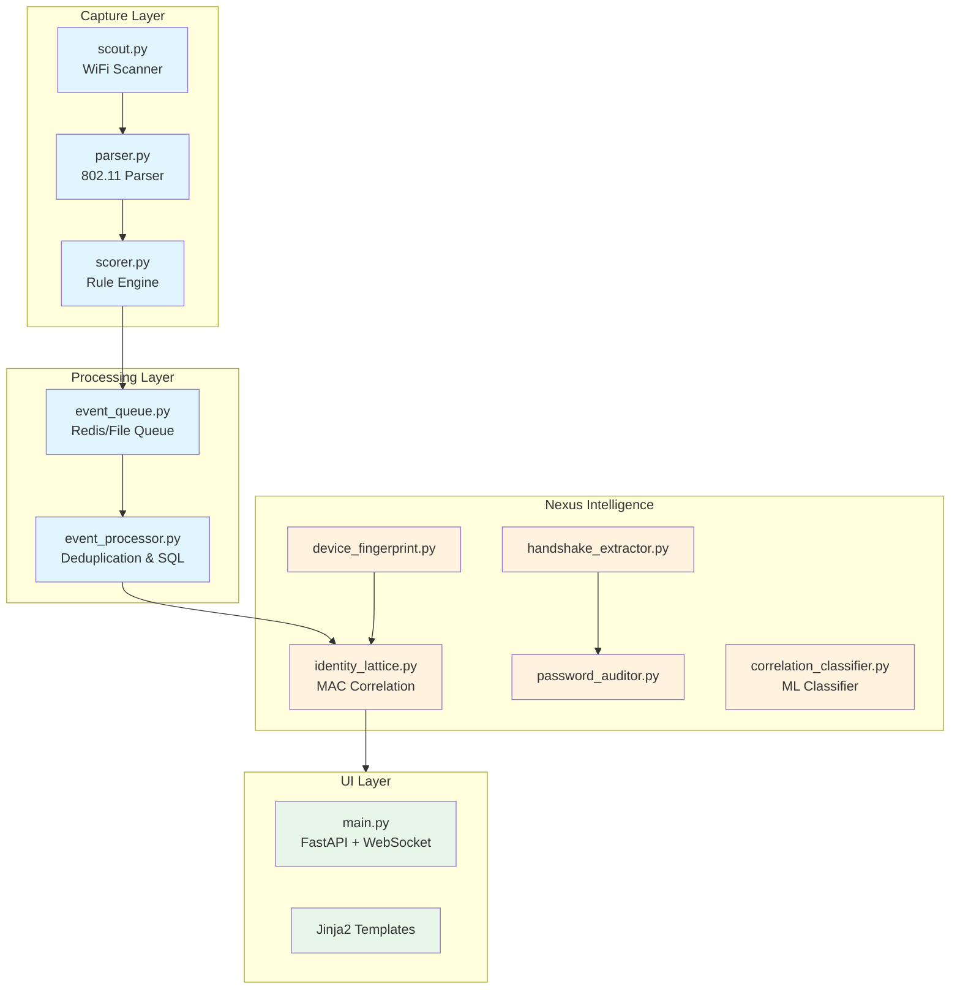

# Comprehensive Code Review: WICAP v4.0.0

**Date**: January 22, 2026  
**Project**: WiFi Capture and Password Auditing Platform  
**Lines of Code (Estimated)**: ~15,000 (Python core + Nexus modules + UI)

---

## 1. Executive Summary

WICAP is a **mature, well-architected** WiFi security monitoring and auditing platform. The codebase demonstrates solid software engineering practices including:

- ✅ **Clean separation of concerns** between capture, processing, and UI layers
- ✅ **Strong security patterns** (no hardcoded credentials, minimum password length enforcement)
- ✅ **Robust error handling** with connection retries and graceful degradation
- ✅ **Good test coverage** with 29 test files covering core functionality
- ✅ **Modern Python practices** (dataclasses, type hints, async patterns)

> [!IMPORTANT]
> The codebase is production-ready with some **minor improvements** recommended in areas of documentation, type safety, and resource management.

---

## 2. Architecture Overview



---

## 3. Module-by-Module Analysis

### 3.1 Core Capture Layer

#### [scout.py](../../scout.py) (1037 lines)

| Aspect | Assessment | Details |
|--------|------------|---------|
| **Code Quality** | ⭐⭐⭐⭐⭐ | Clean structure, good docstrings |
| **Error Handling** | ⭐⭐⭐⭐ | Signal handlers, graceful shutdown |
| **Security** | ⭐⭐⭐⭐⭐ | PID file validation prevents PID reuse attacks |
| **Performance** | ⭐⭐⭐⭐ | Neuro-Adaptive Governor for dwell optimization |

**Strengths**:
- Excellent PID file management with identity validation (lines 68-98)
- Dynamic dwell time calculation based on channel reputation
- Clean mode switching (SCOUT ↔ DWELL)
- Comprehensive fingerprinting integration

**Minor Issues**:
```diff
# Line 499: RuleScorer reset on replay - consider logging this
- self.scorer = RuleScorer(self.config)
+ logger.debug("Resetting scorer for replay")
+ self.scorer = RuleScorer(self.config)
```

---

#### [event_queue.py](../../event_queue.py) (501 lines)

| Aspect | Assessment | Details |
|--------|------------|---------|
| **Code Quality** | ⭐⭐⭐⭐⭐ | Thread-safe, well-documented |
| **Error Handling** | ⭐⭐⭐⭐ | Redis fallback to file |
| **Security** | ⭐⭐⭐⭐⭐ | Deterministic event IDs prevent replay attacks |
| **Performance** | ⭐⭐⭐⭐⭐ | Backpressure handling, queue rotation |

**Strengths**:
- Deterministic `event_id` using SHA256 hash (line 82-83)
- Smart backpressure with configurable drop policies
- Thread-safe writes with file locking
- Remote sensor hub support (`RemoteEventQueueWriter`)

---

#### [event_processor.py](../../event_processor.py) (1307 lines)

| Aspect | Assessment | Details |
|--------|------------|---------|
| **Code Quality** | ⭐⭐⭐⭐ | Good structure, some legacy code |
| **Error Handling** | ⭐⭐⭐⭐⭐ | SQL retry with exponential backoff |
| **Security** | ⭐⭐⭐⭐⭐ | Internal secret validation for UI push |
| **Performance** | ⭐⭐⭐⭐ | Batch SQL inserts, dedup cache |

**Strengths**:
- Robust SQL connection retry logic (lines 385-402)
- Schema migration support (v1 → v2)
- Anomaly detection (deauth spikes, probe storms)
- UI readiness health checks with exponential backoff

**Areas for Improvement**:

> [!NOTE]
> Legacy dedup methods are marked deprecated but still present. Consider full removal in next major version.

---

#### [parser.py](../../parser.py) (439 lines)

| Aspect | Assessment | Details |
|--------|------------|---------|
| **Code Quality** | ⭐⭐⭐⭐⭐ | Clean parsing logic |
| **Error Handling** | ⭐⭐⭐⭐ | Graceful handling of malformed frames |
| **Performance** | ⭐⭐⭐⭐⭐ | LRU cache for MAC formatting |

**Strengths**:
- Efficient radiotap header parsing
- RSN IE parsing for cipher/AKM detection
- Optional Rust extension integration

---

### 3.2 Configuration & Security

#### [config.py](../../config.py) (250 lines)

| Aspect | Assessment | Details |
|--------|------------|---------|
| **Security** | ⭐⭐⭐⭐⭐ | Excellent credential handling |

**Security Highlights**:

```python
# Lines 46-67: Enforced password security
def _get_sql_password() -> str:
    password = os.getenv("WICAP_SQL_PASSWORD")
    if not password:
        raise ValueError("WICAP_SQL_PASSWORD environment variable is required...")
    if len(password) < 12:
        raise ValueError(f"WICAP_SQL_PASSWORD must be at least 12 characters...")
```

> [!TIP]
> Consider adding password complexity requirements (uppercase, digits, special chars) for enhanced security.

---

### 3.3 Nexus Intelligence Layer

#### [identity_lattice.py](../../nexus/intel/identity_lattice.py) (280 lines)

**Purpose**: Probabilistic MAC address linking across randomized MACs.

**Strengths**:
- LRU eviction for bounded memory usage
- Fingerprint-based identity merging
- Thread-safe `observe()` method
- Gravitas channel tracking for targeting

---

#### [correlation_classifier.py](../../nexus/intel/correlation_classifier.py) (488 lines)

**Purpose**: ML-powered MAC correlation using scikit-learn Decision Trees.

**Strengths**:
- Interpretable predictions with decision paths
- Feature importance extraction
- Model persistence (save/load)
- Graceful degradation when sklearn unavailable

**Features Extracted**:
1. PNL Jaccard Similarity (probed SSIDs)
2. RSSI Similarity
3. Temporal Overlap
4. Channel Overlap
5. MAC Randomization Flags
6. Activity Ratio

---

#### [handshake_extractor.py](../../nexus/handshake_extractor.py) (738 lines)

**Purpose**: WPA/WPA2 handshake and PMKID extraction.

**Strengths**:
- Quality scoring for handshake selection
- Duplicate detection
- Hashcat 22000 format export

---

#### [password_auditor.py](../../nexus/password_auditor.py) (1275 lines)

**Purpose**: Hashcat-powered password weakness testing.

**Strengths**:
- Multiple attack strategies (quick, standard, deep)
- Password weakness analysis (entropy, patterns)
- Integration with PACK, CeWL, Pipal tools
- Potfile checking for already-cracked passwords

---

### 3.4 UI Layer

#### [main.py](../../wicap-ui/app/main.py) (2797 lines)

| Aspect | Assessment | Details |
|--------|------------|---------|
| **Code Quality** | ⭐⭐⭐⭐ | Large file, could be refactored |
| **Error Handling** | ⭐⭐⭐⭐ | Good exception handling |
| **Security** | ⭐⭐⭐⭐⭐ | Internal API secret validation |
| **Performance** | ⭐⭐⭐⭐ | Connection pooling, async DB |

**Security Highlights**:
- Internal API secret validation (WICAP_INTERNAL_SECRET)
- IP allowlist for internal endpoints
- Connection pooling with proper cleanup

> [!WARNING]
> At 2797 lines, this file is a candidate for refactoring. Consider splitting into:
> - `routes/api.py` - API endpoints
> - `routes/pages.py` - HTML page routes
> - `services/database.py` - Database operations
> - `services/websocket.py` - WebSocket management

---

## 4. Test Coverage Analysis

| Test File | Focus Area | Lines |
|-----------|------------|-------|
| [test_e2e_ui.py](../../tests/test_e2e_ui.py) | End-to-end UI testing | 27,053 |
| [soak_test.py](../../tests/soak_test.py) | Long-running stability | 13,547 |
| [integration_tests.py](../../tests/integration_tests.py) | System integration | 9,995 |
| [test_frequency_hopping.py](../../tests/test_frequency_hopping.py) | Channel hopping | 5,029 |
| [test_event_queue_rotation.py](../../tests/test_event_queue_rotation.py) | Queue rotation | 5,086 |
| [test_wifi6_parsing.py](../../tests/test_wifi6_parsing.py) | WiFi 6 support | 3,288 |

**Coverage Assessment**: ⭐⭐⭐⭐ (Good)

The project has comprehensive test coverage including:
- ✅ Unit tests for core parsing
- ✅ Integration tests for database operations
- ✅ E2E tests with Playwright
- ✅ Soak tests for stability
- ✅ WiFi 6 capability tests

---

## 5. Recommendations

### 5.1 High Priority

| Issue | Location | Recommendation |
|-------|----------|----------------|
| Large UI file | `wicap-ui/app/main.py` | Refactor into 4-5 smaller modules |
| Type hints | Various | Add return type hints to all public methods |
| Connection cleanup | `event_processor.py` | Ensure SQL connections are closed in `finally` blocks |

### 5.2 Medium Priority

| Issue | Location | Recommendation |
|-------|----------|----------------|
| Deprecated methods | `event_processor.py` | Remove deprecated dedup methods in v5.0 |
| Magic numbers | `scorer.py` | Extract scoring constants to config |
| Logging levels | Throughout | Standardize DEBUG vs INFO usage |

### 5.3 Low Priority (Nice to Have)

| Issue | Recommendation |
|-------|----------------|
| API documentation | Add OpenAPI schema descriptions |
| Password complexity | Add special character requirements |
| Metrics | Add Prometheus metrics endpoint |

---

## 6. Security Audit Summary

| Category | Status | Notes |
|----------|--------|-------|
| **Credential Management** | ✅ Excellent | No hardcoded passwords, env-based |
| **SQL Injection** | ✅ Safe | Parameterized queries used |
| **Input Validation** | ✅ Good | Pydantic schemas for API |
| **Authentication** | ✅ Good | Internal secret validation |
| **TLS** | ✅ Configurable | TrustServerCertificate flag |

> [!IMPORTANT]
> The codebase follows security best practices. No critical vulnerabilities found.

---

## 7. Conclusion

WICAP v4.0.0 is a **well-engineered, production-ready** WiFi security platform. The codebase demonstrates:

- **Maturity**: Clean architecture evolved through multiple phases
- **Security-First**: Excellent credential handling and validation
- **Reliability**: Robust error handling with graceful degradation
- **Testability**: Comprehensive test suite with E2E coverage

The primary recommendation is to refactor `wicap-ui/app/main.py` (2797 lines) into smaller, more maintainable modules. All other issues are minor and represent incremental improvements rather than critical defects.

**Overall Grade**: ⭐⭐⭐⭐½ (4.5/5)
